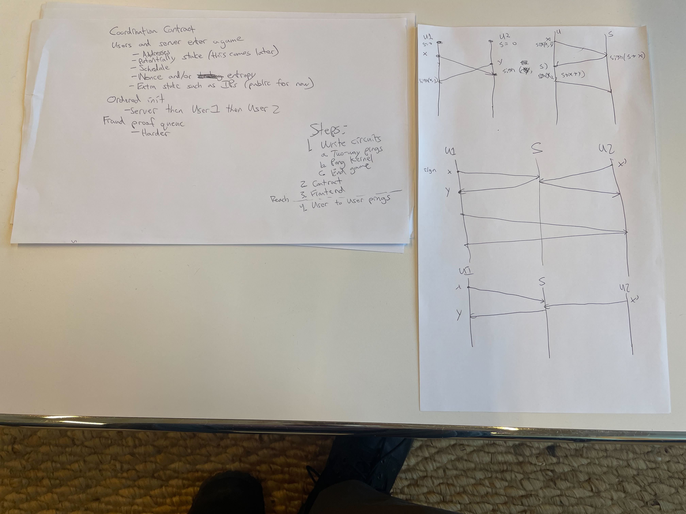

# zk-pong

Real-time certified Pong with Distributed Secure Clocks in Noir

## Design

- Users and server confirm a game proposal
- The game is played and all intermediate states are signed
- At the end of the game, the log with signatures is certified in a circuit for:
  + Game setup/teardown/reward structure
  + Tetris rules
  + Timeliness

